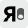
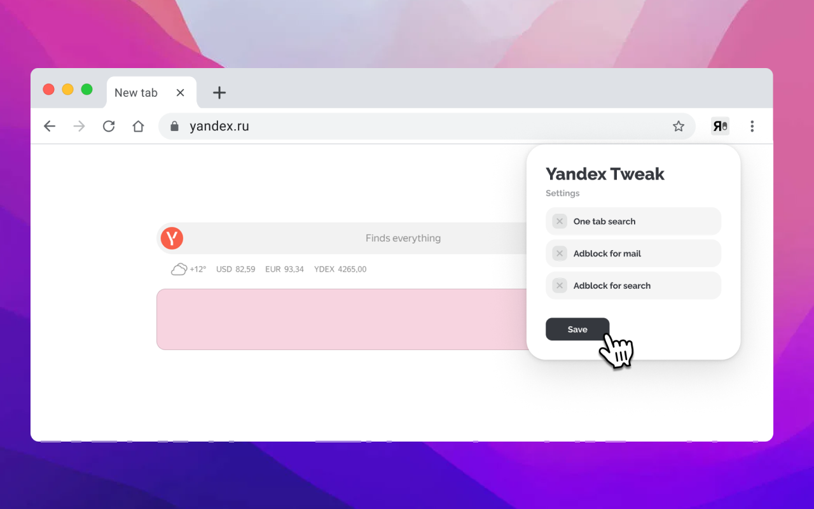

  English | <a href="README.ru.md">Русский</a>

  <h2>Yandex Tweak </h2>
  
This extension is created for users of Yandex services.  It helps to avoid creating multiple tabs during search and also blocks ads in Yandex Mail.

<h2>Extension Installation</h2>

Manual Installation

1. Open the extensions page (chrome://extensions)
2. Enable developer mode (top right corner)
3. Load unpacked extension (top left corner)

Extension in stores
 

1. https://vk.cc/cKRx0U

Figma
---

Link

[https://www.figma.com/design/x8ccQmPEr58mwUo7WYNipZ/Yandex-Tweak?node-id=0-1&t=pgswNMBTa3I3TeOz-1](https://www.figma.com/community/file/1579538447498412448)

