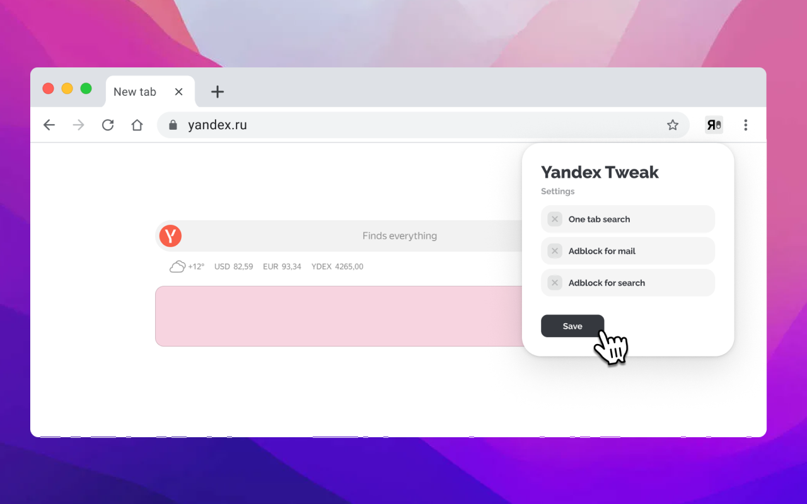

  English | <a href="README.ru.md">Русский</a>

  <h2>Yandex Tweak </h2>
  
This extension is created for users of Yandex services.  It helps to avoid creating multiple tabs during search and also blocks ads in Yandex Mail.

<h2>Extension Installation</h2>

Manual Installation

1. Open the extensions page (chrome://extensions)
2. Enable developer mode (top right corner)
3. Load unpacked extension (top left corner)

Extension in stores
 

1. https://chromewebstore.google.com/detail/%D1%8F%D0%BD%D0%B4%D0%B5%D0%BA%D1%81-%D1%82%D0%B2%D0%B8%D0%BA-adblock-%D0%BF%D0%BE%D1%87%D1%82%D1%8B/gdmgaolhbllpodgbdpmgbcdnplkcijcd

Figma
---

Link

https://www.figma.com/community/file/1579538447498412448

