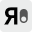
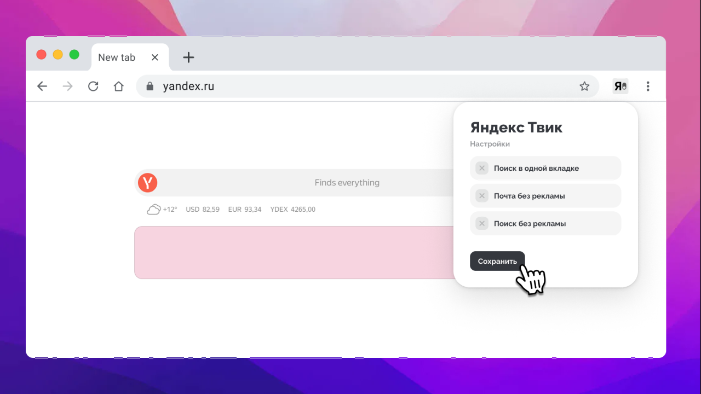

  <a href="README.md">English</a> | Русский

  <h2>Яндекс Твик </h2>
  
Данное расширение создано для пользователей серверов Яндекса.  Позволяет не плодить вкладки при поиске, а также блокировать рекламу в Яндекс Почте, Яндекс Погоде и в поиске Яндекса.

<h2>Установка расширения</h2>

Cложная установка

1. Открыть страницу (chrome://extensions)
2. Включить режим разработчика (правый верхний угол)
3. Загрузить распакованное расширение (левый верхний угол)

Расширение в магазинах расширений
 

1. https://chromewebstore.google.com/detail/%D1%8F%D0%BD%D0%B4%D0%B5%D0%BA%D1%81-%D1%82%D0%B2%D0%B8%D0%BA-adblock-%D0%BF%D0%BE%D1%87%D1%82%D1%8B/gdmgaolhbllpodgbdpmgbcdnplkcijcd

Фигма
---

Ссылка

https://www.figma.com/community/file/1579538447498412448

